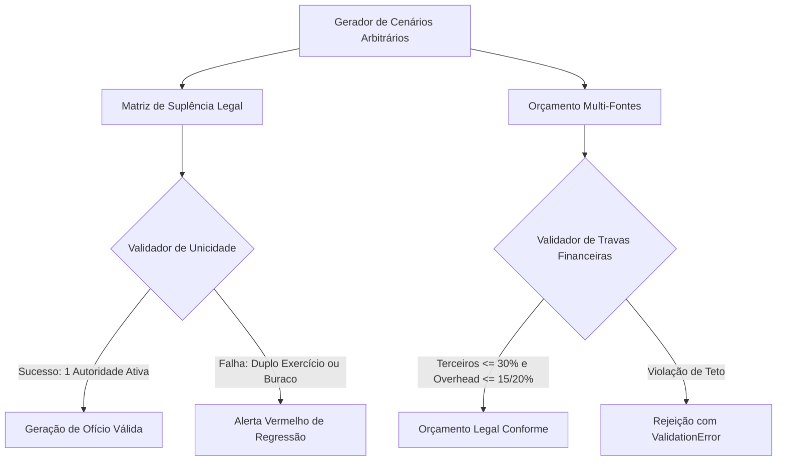

# Design Técnico: Suíte de Property-Based Testing de Invariantes

## 1. Arquitetura da Solução de QA

A suíte será implementada no módulo `gestao_projetos/tests_properties.py` utilizando o framework de testes nativo do Django (`django.test.TestCase` / `SimpleTestCase`) integrado a geradores determinísticos e pseudo-aleatórios parametrizados (e compatível com `hypothesis` quando o pacote estiver instalado no ambiente).

## 2. Propriedades Formais a Testar

### Propriedade 1: Idempotência e Unicidade Temporal
Para qualquer função $F$ e para qualquer conjunto de $N$ ocupações com prioridades $0, 1, \dots, N-1$:
$$\forall D \in \text{Timeline}, \quad |\text{Exercício}(F, D)| \le 1$$
Nenhuma data pode retornar mais de uma pessoa física no exercício do poder, mesmo que haja 5 substitutos cadastrados.

### Propriedade 2: Monotonicidade de Prioridade
Se uma ocupação de prioridade $k$ está em exercício no dia $D$, então obrigatoriamente:
$$\forall j < k, \quad \text{Ocupacao}_j \text{ está afastada no dia } D$$

### Propriedade 3: Conservação de Fontes Orçamentárias
$$\sum \text{Rubricas} = \text{Aporte}_{\text{Empresa}} + \text{Aporte}_{\text{EMBRAPII}} + \text{Aporte}_{\text{Sebrae}} + \text{Contrapartida}$$
Nenhuma rubrica pode ter fonte não declarada nem extrapolar os tetos regulamentares.

## 3. Isolamento e Segurança
- Todos os testes de propriedade devem rodar com banco de teste em memória (`TestCase` transacional), sem alterar ou persistir dados no banco de desenvolvimento `argus_db`.
- Arquivos de modelos de negócio (`cadastros/models.py`) permanecem intocados.
