# Modelo Entidade-Relacionamento (MER) — ARGUS

**Sistema Integrado de Gestão do Polo de Inovação IFAM**  
**Versão:** 1.0  
**Data:** 2026-09-04  
**Responsável:** Antigravity-Gemini (Arquiteto de Software & Guardião do Domínio)

---

## 1. Visão Geral do Banco de Dados

O banco de dados relacional do ARGUS (PostgreSQL) implementa a integridade referencial necessária para sustentar a tríplice hélice da Lei de Inovação (Lei 10.973/2004), o padrão *Party-Role* de governança da LGPD e as travas de execução financeira exigidas por órgãos fiscalizadores (EMBRAPII, SUFRAMA e TCU).

---

## 2. Diagrama Entidade-Relacionamento (ERD Global)

```mermaid
erDiagram
    %% Governança de Fomento Macro
    TermoCooperacao ||--o{ Programa : "subdivide em (1:N)"
    Programa ||--o{ ProjetoPDI : "financia (1:N)"
    
    %% Hélice Tríplice e Parcerias
    PessoaJuridica ||--|| ICT : "herda (multi-tabela)"
    PessoaJuridica ||--|| EmpresaParceira : "herda (multi-tabela)"
    PessoaJuridica ||--|| FundacaoApoio : "herda (multi-tabela)"
    PessoaJuridica ||--|| AgenciaFomento : "herda (multi-tabela)"

    TermoDeParceria }o--|| PessoaJuridica : "concedente (Empresa)"
    TermoDeParceria }o--|| ICT : "convenente executora"
    TermoDeParceria }o--|| FundacaoApoio : "interveniente financeira"
    ProjetoPDI ||--o{ TermoDeParceria : "formalizado por (1:N)"

    %% Identidade Canônica e LGPD (Party-Role)
    PessoaFisica ||--o| PerfilServidor : "papel funcional"
    PessoaFisica ||--o| PerfilBolsista : "papel acadêmico"
    PessoaFisica ||--o| PerfilAluno : "papel discente"
    PessoaFisica ||--o{ DadoBancario : "dados restritos (1:N)"
    PessoaFisica ||--o| auth_User : "credencial vinculada pelo Admin"

    %% Plano de Trabalho e Escopo Técnico
    ProjetoPDI ||--o{ PlanoDeTrabalho : "versões (1:N)"
    TermoDeParceria ||--o{ PlanoDeTrabalho : "homologa (1:N)"
    PlanoDeTrabalho ||--o{ Macroentrega : "decomposto em (1:N)"
    Macroentrega ||--o{ AtividadePlanoAcao : "contém (1:N)"
    PlanoDeTrabalho ||--o{ RubricaOrcamentaria : "prevê (1:N)"

    %% Recursos Humanos e Bolsas
    PlanoDeTrabalho ||--o{ MembroEquipePT : "equipe alocada"
    MembroEquipePT }o--|| PessoaFisica : "membro"
    PlanoDeTrabalho ||--o{ CotaBolsaPT : "cotas orçadas"
    CotaBolsaPT ||--o{ TermoBolsa : "concede (1:N)"
    TermoBolsa }o--|| PessoaFisica : "bolsista beneficiário"

    %% Execução Financeira e Auditoria
    TermoBolsa ||--o{ Parcela : "cronograma mensal"
    Parcela ||--o| RelatorioAtividade : "comprovado por (1:1)"
    RelatorioAtividade }o--|| PessoaFisica : "atestado_por (SIAPE)"
    Parcela }o--o| ContaBancaria : "liquidado via"

    %% Infraestrutura e Espaços
    Ambiente ||--o{ Ambiente : "ambiente_pai (Composite)"
```

---

## 3. Dicionário de Dados dos Núcleos Principais

### 3.1 Núcleo de Governança e Parcerias

#### `TermoCooperacao`
Instrumento jurídico matriz (guarda-chuva) firmado entre o IFAM e parceiros institucionais.
* `id` (PK, Integer, Auto)
* `numero` (Varchar(50), Unique): Número do Termo no SIPAC (ex: "01/2026").
* `objeto` (Text): Finalidade geral da cooperação técnica.
* `concedente_id` (FK -> `PessoaJuridica`): Instituição parceira.
* `convenente_id` (FK -> `ICT`): IFAM / Polo de Inovação.
* `data_inicio` / `data_fim` (Date): Vigência jurídica.
* `valor_global` (Decimal(15,2)): Montante total orçado.

#### `Programa`
Subdivisão ou linha de fomento temática vinculada a um Termo de Cooperação.
* `id` (PK, Integer, Auto)
* `termo_cooperacao_id` (FK -> `TermoCooperacao`): Acordo-mestre guarda-chuva.
* `nome` (Varchar(255)): Título do programa (ex: "PDC - Automação Industrial 2026").
* `descricao` (Text, Opcional): Escopo da linha temática.
* `ativo` (Boolean, Default True).

#### `ProjetoPDI`
Entidade mestre de pesquisa aplicada e desenvolvimento tecnológico.
* `id` (PK, Integer, Auto)
* `nome` (Varchar(255)): Nome completo da pesquisa.
* `projeto` (Varchar(50), Opcional): Sigla/Apelido do projeto.
* `fase` (Varchar(20)): `PROSPECCAO`, `EXECUCAO`, `PRESTACAO_CONTAS`, `ENCERRADO`, `CANCELADO`.
* `programa_id` (FK -> `Programa`, Opcional): Acordo de fomento guarda-chuva.
* `concedente_id` (FK -> `PessoaJuridica`): Financiador principal (Empresa).
* `convenente_id` (FK -> `ICT`): ICT Executora.
* `interveniente_id` (FK -> `FundacaoApoio`): Gestão administrativa-financeira.
* `processo` (Varchar(20)): Número do processo administrativo no SIPAC.
* `data_inicio` / `data_fim` (Date): Período de vigência da pesquisa.

#### `TermoDeParceria`
Instrumento legal tripartite que operacionaliza o Projeto PDI perante a Lei 10.973/2004.
* `id` (PK, Integer, Auto)
* `numero` (Varchar(50), Unique): Número do registro.
* `projeto_id` (FK -> `ProjetoPDI`, Opcional): Projeto vinculado.
* `concedente_id` (FK -> `PessoaJuridica`): Empresa financiadora.
* `convenente_id` (FK -> `ICT`): Polo de Inovação executora.
* `interveniente_id` (FK -> `FundacaoApoio`): Fundação de Apoio contratada.
* `data_assinatura` (Date).

---

### 3.2 Núcleo de Identidade e LGPD (Party-Role Pattern)

#### `PessoaFisica`
Repositório central de identidade canônica do cidadão.
* `id` (PK, Integer, Auto)
* `nome` (Varchar(255)): Nome civil completo.
* `cpf` (Varchar(14), Unique): Cadastro de Pessoa Física.
* `email` (EmailField): Contato institucional/pessoal.
* `telefone` (Varchar(20)): Contato telefônico.
* `user_id` (OneToOne -> `auth.User`, Opcional): Vínculo restrito ao Administrador.

#### `PerfilServidor`
Papel funcional desempenhado por servidor do quadro efetivo.
* `id` (PK, Integer, Auto)
* `pessoa_fisica_id` (OneToOne -> `PessoaFisica`).
* `matricula_siape` (Varchar(20), Unique): Identificação funcional federal estável.
* `cargo` / `lotacao` (Varchar(100)).
* `is_docente` / `is_tecnico` (Boolean).

#### `DadoBancario`
Dados de pagamento com segregação de acesso (RBAC estrito).
* `id` (PK, Integer, Auto)
* `pessoa_fisica_id` (FK -> `PessoaFisica`).
* `banco` (Varchar(50)): Código/Nome da instituição financeira.
* `agencia` (Varchar(20)): Número da agência com dígito.
* `conta_corrente` (Varchar(30)): Conta bancária titular.
* `chave_pix` (Varchar(100), Opcional).

---

### 3.3 Núcleo de Execução Técnica e Financeira

#### `PlanoDeTrabalho`
Detalhamento metodológico, físico e financeiro do projeto.
* `id` (PK, Integer, Auto)
* `projeto_id` (FK -> `ProjetoPDI`).
* `termo_homologador_id` (FK -> `TermoDeParceria`, Opcional).
* `versao` (Integer, Default 1): Controle de aditivos.
* `status` (Varchar(30)): `RASCUNHO`, `CONGELADO_VIGENTE`, `RETIFICADO`, `ENCERRADO`.
* `objetivo_geral` / `metodologia` (Text).

#### `Macroentrega`
Marcos de entrega tecnológica orientados à escala TRL 3 a 6.
* `id` (PK, Integer, Auto)
* `plano_trabalho_id` (FK -> `PlanoDeTrabalho`).
* `numero` (Integer): Sequenciador ordinal.
* `titulo` (Varchar(255)): Título da macroentrega.
* `data_inicio` / `data_fim` (Date): Intervalo temporal não-sobreposto.
* `meta_tecnica` (Text).

#### `TermoBolsa`
Concessão individual de bolsa de pesquisa vinculada a uma cota orçamentária.
* `id` (PK, Integer, Auto)
* `cota_id` (FK -> `CotaBolsaPT`): Cota orçamentária de origem.
* `bolsista_id` (FK -> `PessoaFisica`): Beneficiário da bolsa.
* `valor_mensal` (Decimal(10,2)): Valor de cada parcela.
* `data_inicio` / `data_fim` (Date): Vigência da bolsa.
* `ativo` (Boolean, Default True).

#### `Parcela`
Registro financeiro mensal da bolsa a ser liquidado pela Fundação.
* `id` (PK, Integer, Auto)
* `termo_bolsa_id` (FK -> `TermoBolsa`).
* `competencia` (Varchar(7)): Mês/Ano de referência (ex: "09/2026").
* `valor` (Decimal(10,2)).
* `status` (Varchar(20)): `PENDENTE`, `PROCESSANDO`, `PAGO`, `CANCELADO`.
* `data_pagamento` (DateField, Opcional).
* `conta_pagamento_id` (FK -> `ContaBancaria`, Opcional).
* `comprovante_pagamento` (FileField, Opcional): Comprovante bancário de liquidação.

#### `RelatorioAtividade`
Comprovação técnica mensal indispensável para a liberação da parcela.
* `id` (PK, Integer, Auto)
* `parcela_id` (OneToOne -> `Parcela`).
* `resumo_atividades` (Text): Atividades desempenhadas no período.
* `horas_trabalhadas` (PositiveIntegerField): Carga horária executada.
* `status` (Varchar(20)): `PENDENTE`, `EM_ANALISE`, `CONCLUIDO`, `DEVOLVIDO`.
* `atestado_por_id` (FK -> `PessoaFisica`, Opcional): Servidor efetivo que homologou.
* `siape_atesto` (Varchar(20), Opcional): Matrícula SIAPE registrada no carimbo digital.
* `data_atesto` (DateTimeField, Opcional): Timestamp do atesto legal.
