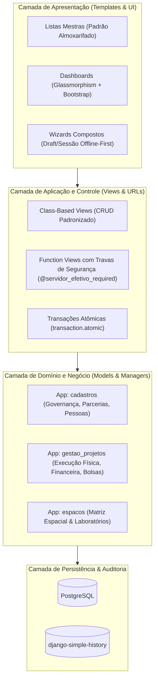
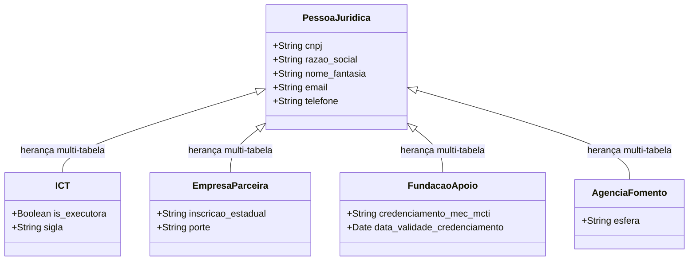
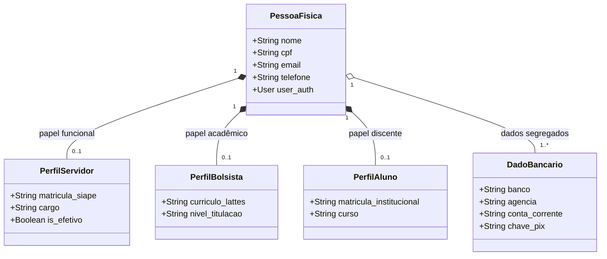
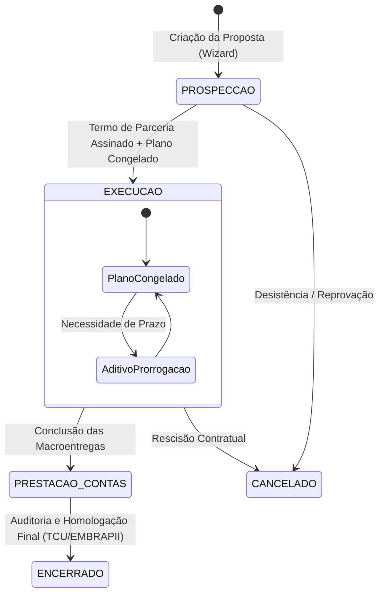
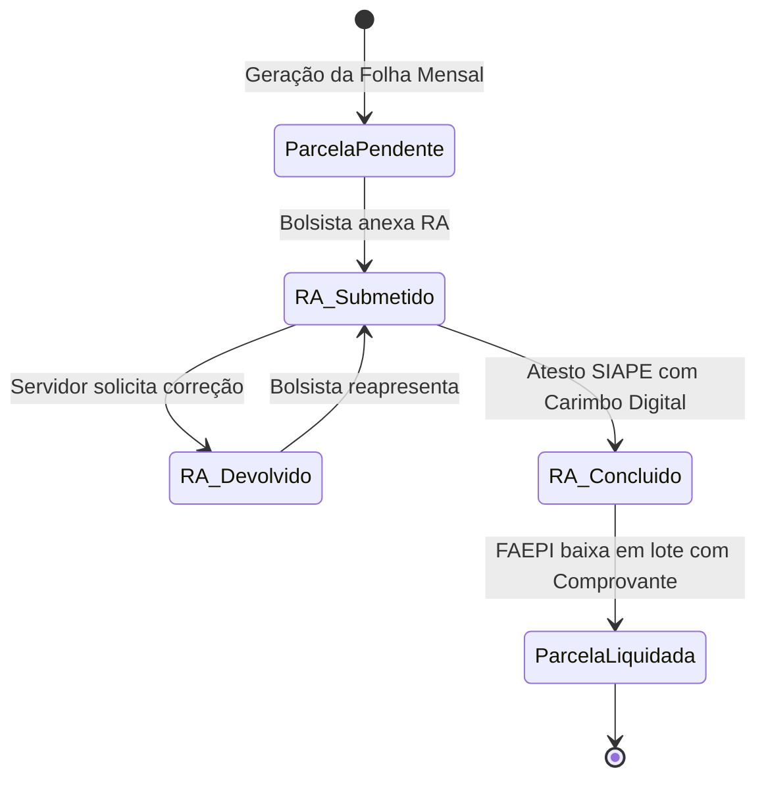
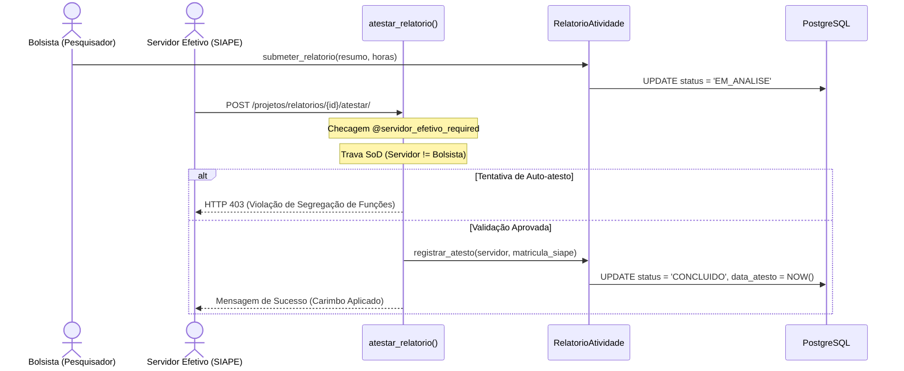
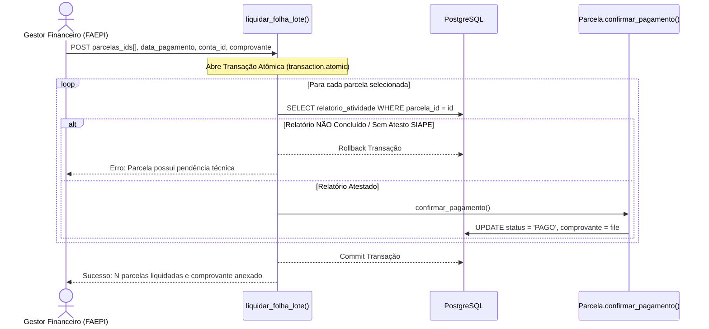

# Arquitetura de Software e Diagramas UML — ARGUS

**Sistema Integrado de Gestão do Polo de Inovação IFAM**  
**Versão:** 1.0  
**Data:** 2026-09-04  
**Responsável:** Antigravity-Gemini (Arquiteto de Software & Guardião do Domínio)

---

## 1. Visão Geral da Arquitetura

O **ARGUS** adota o padrão arquitetural **MVT (Model-View-Template)** do Django sobre o **PostgreSQL**, estruturado segundo os princípios de **Domain-Driven Design (DDD)** para refletir a governança da Lei 10.973/2004 e as diretrizes EMBRAPII/SUFRAMA.

---

## 2. Diagramas de Classes (UML)

### 2.1 Herança Multi-tabela de Pessoa Jurídica (Hélice Tríplice)

### 2.2 Party-Role Pattern de Pessoa Física (LGPD)

---

## 3. Diagramas de Máquinas de Estados (Statechart)

### 3.1 Ciclo de Vida do Projeto de PD&I

### 3.2 Ciclo de Vida da Parcela de Bolsa e Relatório de Atividade

---

## 4. Diagramas de Sequência

### 4.1 Atesto de Relatório de Atividades com Segregação de Funções (SoD)

### 4.2 Liquidação e Baixa em Lote da Folha de Bolsas pela FAEPI

