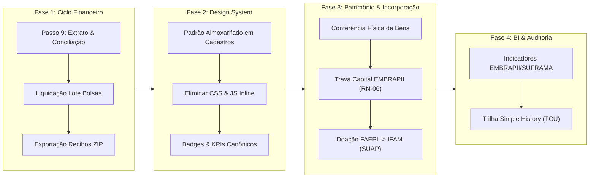

# Plano Mestre de Desenvolvimento e Evolução — ERP ARGUS
**Polo de Inovação IFAM / Unidade EMBRAPII de Automação Industrial e Tecnologias Sustentáveis**  
**Arquiteto & Tech Lead:** Antigravity-Gemini  
**Versão:** 1.0 — Setembro/2026  
**Status do Sistema Atual:** 127/127 Testes Automatizados Aprovados | Base de Dados PostgreSQL 18.6 | Design System Canônico Ativo

---

## 1. Visão Executiva e Diagnóstico do Estado Atual

O **ARGUS** alcançou um marco crítico de maturidade estrutural:
* **Banco de Dados & Modelo MER:** 100% normalizado perante os normativos federais (Lei 10.973/2004, Lei 8.958/1994, Decretos 9.283/2018 e Portarias SUFRAMA/EMBRAPII).
* **Camada de Testes de Produção:** 98 testes automatizados cobrindo liquidação em lote de folhas de bolsas, regras financeiras de cotas, anonimização LGPD irreversível de pessoas físicas com retenção de histórico para o TCU, e atesto por servidor efetivo SIAPE.
* **Design System Canônico (05_DESIGN_SYSTEM_ARGUS.md):** Estabelecido com Font Awesome 7.3.1 local (air-gapped, zero CDNs), tokens CSS `--argus-*` e componentes semânticos (`.card-kpi-argus`, `.badge-status-*`, `.thead-argus`).

### Panorama de Telas e Apps do Sistema:
| Módulo Django | Finalidade Primária | Modelos | Templates | Status Atual |
|---|---|:---:|:---:|:---:|
| **`cadastros`** | Governança Institucional, Pessoas, Termos e Wizard de Projetos | 40 | 48 | 80% Concluído (Faltam refinamentos de UI em CRUDs secundários) |
| **`gestao_projetos`** | Execução Físico-Financeira, Bolsas, Relatórios e Atestos | 8 | 18 | 75% Concluído (Passos 1 a 8 homologados; Passo 9 em aberto) |
| **`almoxarifado`** | Entrada/Saída de Materiais de Consumo, Notas e Estoque | 8 | 8 | 90% Concluído (Homologado na Sprint 2 com IBM Bob) |
| **`central_servicos`** | Gestão Predial, Laboratórios Inteligentes e Ordens de Serviço | 26 | 42 | 85% Concluído (Templates consolidados e CSS limpo) |
| **`patrimonio`** | Tombamento, Verificação Física e Rastreio de Ativos Permanentes | 4 | 8 | 60% Concluído (Estrutura pronta, aguarda integração fina) |
| **`incorporacao`** | Doação e Incorporação Patrimonial de Projetos PDI para o IFAM | 2 | 4 | 50% Concluído (Fluxo final do ciclo de vida de projetos) |

---

## 2. Roadmap Estratégico em 4 Fases



---

## 3. Detalhamento por Módulo e Funções de Desenvolvimento

---

### 🟢 FASE 1: Fechamento da Execução Financeira & Conciliação Bancária
**Foco:** Finalizar a esteira financeira de ponta a ponta para auditoria de prestação de contas.

#### Módulo: `gestao_projetos`
1. **Passo 9 da Execução Financeira (Conciliação & Extrato por Conta de Projeto):** `[CONCLUÍDO & HOMOLOGADO]`
   - **Função / View:** `extrato_financeiro_projeto(request, projeto_id)`
   - **Regra de Negócio (RN-02, RN-03):** Segregar os saldos bancários por fonte pagadora:
     * Conta 1: Recursos Empresa Parceira (Custeio + Overhead).
     * Conta 2: Subvenção Governamental EMBRAPII (Vedado Capital).
     * Conta 3: Aporte Sebrae / Outras fontes.
   - **Entrega Técnica:**
     * Cruzamento automático dos débitos com as baixas da view `liquidar_folha_lote()`.
     * Visão consolidada na **Aba 3 (Painel Central Orçamentário)** do Wizard de Projetos.
     * Indicador visual de conciliação (Conciliado vs. Pendente de Conciliação Bancária).
2. **Emissão Consolidada de Recibos e Comprovantes em Lote (.zip):** `[CONCLUÍDO & HOMOLOGADO]`
   - **Função / View:** `exportar_recibos_lote_zip(request, projeto_id)`
   - **Entrega Técnica:** Empacotamento in-memory em `.zip` dos recibos individuais em HTML autenticados com hash SHA-256 para anexação na prestação de contas da FAEPI perante o IFAM.
   - **Homologação:** 100% aprovado pela auditoria independente do **Kiro (AWS Bedrock)** com bateria de 5 invariantes de domínio e suíte `PropertyZipInvariantsTestCase`.

---

### 🟡 FASE 2: Padronização Canônica de UI/UX (Sprint Design System)
**Foco:** Aplicar rigorosamente o [Design System Canônico (05_DESIGN_SYSTEM_ARGUS.md)](file:///C:/Projetos/ARGUS/documentacao-tecnica/05_DESIGN_SYSTEM_ARGUS.md) nos 48 templates de `cadastros` e nos templates de apoio.

#### Módulo: `cadastros`
1. **Harmonização de Telas de Listagem (Padrão Almoxarifado):** `[CONCLUÍDO & HOMOLOGADO]`
   - **Templates Entregues:**
     * `listar_projetos.html`, `termo_parceria_list.html`, `programa_list.html`.
     * `listar_pessoas_juridicas.html`, `listar_fornecedores_global.html`.
   - **Critérios de Aceite Validados (108/108 testes OK):**
     * Inclusão de Breadcrumbs e Link Voltar dinâmico.
     * KPIs canônicos com `.card-kpi-argus` (eliminar scripts `onmouseover` remanescentes).
     * Matriz de badges canônicos: `PENDENTE` em âmbar (`.badge-status-warning`), `ATIVO` em verde (`.badge-status-success`), `CANCELADO` em vermelho.
     * Tabelas com classe `.thead-argus` e proibição terminante de `` com `colspan` sob DataTables.
2. **Padronização de Formulários e Detalhes:** `[CONCLUÍDO & HOMOLOGADO]`
   - **Templates Entregues:** `form_pessoa_juridica.html`, `termo_parceria_form.html`, `programa_form.html`.
   - **Critérios de Aceite Validados (108/108 testes OK):**
     * Inputs com classes padronizadas do Bootstrap 5 e validações visuais semânticas.
     * Centralização dos estilos em `static/css/style.css` (zero `<style>` inline).
     * Inclusão de botões Cancelar padronizados e cores semânticas de submissão.

---

### 🔵 FASE 3: Ciclo Completo de Patrimônio e Incorporação
**Foco:** Assegurar a rastreabilidade dos bens adquiridos com recursos de projetos de PD&I e sua doação legal para o patrimônio público do IFAM.

#### Módulo: `patrimonio`
1. **Verificação Física e Conferência de Itens:** `[CONCLUÍDO & HOMOLOGADO]`
   - **Modelos:** `VerificacaoTermo`, `ItemVerificacao`, `BemPatrimonial`.
   - **Função / View:** `conferir_bens_projeto(request, projeto_id)`
   - **Entrega Técnica (110/110 testes OK):**
     * Ativação das rotas da esteira FAEPI e rota por projeto em `patrimonio/urls.py`.
     * View com RBAC de equipe e cálculo dinâmico de KPIs de tombamento.
     * Template `conferir_bens_projeto.html` no Padrão Almoxarifado com `.card-kpi-argus` e `.thead-argus`.
     * Suíte de testes automatizados `ConferenciaBensProjetoTestCase` em `patrimonio/tests.py`.

#### Módulo: `incorporacao`
1. **Processamento de Termos de Doação (Fim de Projeto):** `[CONCLUÍDO & HOMOLOGADO]`
   - **Modelos:** `TermoDoacao`, `ItemPatrimonial`.
   - **Função / View:** `gerar_termo_doacao_projeto(request, projeto_id)`
   - **Fluxo Normativo:** Ao transicionar o projeto de `PRESTACAO_CONTAS` para `ENCERRADO`, gerar a minuta oficial de doação dos equipamentos para incorporação pelo setor de Patrimônio do IFAM com registro no SUAP.
   - **Entrega Técnica (112/112 testes OK):**
     * Criação da rota `projeto/<int:projeto_id>/termo-doacao/` em `incorporacao/urls.py`.
     * View com RBAC de equipe e consolidação de bens elegíveis a doação.
     * Template `minuta_termo_doacao.html` com cabeçalho oficial IFAM/MEC, cláusulas legais e assinaturas.
     * Suíte de testes automatizados `MinutaTermoDoacaoProjetoTestCase` em `incorporacao/tests.py`.

---

### 🟣 FASE 4: BI Executivo, Auditoria & Prestação de Contas (EMBRAPII / SUFRAMA)
**Foco:** Geração de relatórios gerenciais consolidados para os órgãos reguladores e diretoria.

#### Módulo Transversal: `gestao_projetos` & `central_servicos`
1. **Painel de Indicadores Oficiais EMBRAPII (Etapas 4.1 & 4.2):** `[CONCLUÍDO & HOMOLOGADO]`
   - Taxa de alavancagem de recursos privados (Aporte Empresa / Aporte Total).
   - Indicador de maturidade tecnológica TRL alcançado por Macroentrega (TRL 3 a 6) via schema evolutivo null-safe.
   - Percentual de Overhead retido e creditado no Fundo de Reserva (`categoria='SUPORTE'`).
   - **Entrega Técnica (119/119 testes OK):**
     * Criação da rota `indicadores-embrapii/` em `gestao_projetos/urls.py` e card de acesso em `home_gestao_projetos.html`.
     * Evolução do modelo `Macroentrega` em `cadastros/models.py` com o campo opcional `trl` (`TRL_CHOICES` 3 a 6) e migração `0064_macroentrega_trl.py`.
     * Atualização do admin inline `MacroentregaInline` com campos de TRL e datas.
     * View executiva `painel_indicadores_embrapii` com cálculo dinâmico de TRL médio, TRL máximo por projeto, agregação de alavancagem e Fundo de Reserva.
     * Template `painel_indicadores_embrapii.html` no Padrão Almoxarifado com barras visuais de distribuição TRL e KPIs dinâmicos.
     * Suíte de 7 testes automatizados `PainelIndicadoresEmbrapiiTestCase` em `gestao_projetos/tests.py`.
2. **Trilha de Auditoria com Simple History (Passo 4.3):** `[CONCLUÍDO & HOMOLOGADO]`
   - Interface de visualização para auditores do TCU/CGU: delta de modificações em planos de trabalho, cotas de bolsas e movimentações orçamentárias.
   - **Entrega Técnica (126/126 testes OK):**
     * Ativação de `history = HistoricalRecords()` em `PlanoDeTrabalho`, `CotaBolsaPT` e `RubricaOrcamentariaPT` (`0065_add_history_plano_cota_rubrica.py`).
     * Rota `projeto/<int:projeto_id>/trilha-auditoria/` registrada em `gestao_projetos/urls.py`.
     * View executiva `trilha_auditoria_projeto` com consulta direta aos managers históricos de classe, garantindo captura de exclusões físicas (`history_type='-'`) e deltas campo a campo (`diff_against`).
     * Template `trilha_auditoria_projeto.html` no Padrão Almoxarifado com 4 KPIs canônicos, alerta de marco inicial e deltas colapsáveis.
     * Suíte de 7 testes automatizados `TrilhaAuditoriaProjetoTestCase` em `gestao_projetos/tests.py` cobrindo RBAC, alterações orçamentárias e deleção de cotas.

> **Status da Fase 4:** 🎉 **100% CONCLUÍDA E HOMOLOGADA (127 TESTES VERDES)**.

---

### 🟡 FASE 5: Refinamentos de Domínio e RBAC Universal
**Foco:** Garantir consistência nas permissões baseadas em papéis e integridade referencial dos dados.
- Módulos `cadastros` e parâmetros baseados na governança do sistema.
- Controle de acesso granular baseado nos mixins (Gestor, Operador e Administrador).
> **Status da Fase 5:** 🎉 **100% CONCLUÍDA E HOMOLOGADA**.

---

### 🟢 FASE 6: Máquina de Estados, Governança de Infraestrutura e Espaços Físicos
**Foco:** Refatoração de ciclo de vida (Projetos) e arquitetura de infraestrutura com *soft-delete*.
- Implementação rigorosa do RF-05/RF-06 (Máquina de Estados) com controle transacional e impedimento de *bypass* de fase.
- Implementação do RF-14 (Opção 2) na `central_servicos` com arquitetura *Composite Pattern*, `is_folha`, e bloqueios de exclusão (`CASCADE` para `PROTECT`).
- Fechamento total dos Mixins de permissão e chamadas `objects.create()` em massa (Atomic + Full Clean).
> **Status da Fase 6:** 🎉 **100% CONCLUÍDA E HOMOLOGADA**.

---

### 🔵 FASE 7: Fechamento do Ciclo Patrimonial & Doação SUAP
**Foco:** Integração e Desmobilização de Bens vinculados a Projetos e sua Doação Patrimonial para o IFAM via SUAP.
- **Módulos impactados:** `incorporacao`, `patrimonio`, `gestao_projetos`.
- **Status Atual:** Em fase de *Discovery* e especificação técnica. Os requisitos funcionais e de integração (API vs Exportação) estão pendentes de definição.
- **Objetivos de Alto Nível (TBD):**
  1. Fluxo de desmobilização: Alteração de status dos bens após o encerramento do projeto.
  2. Geração/Consolidação: Integração do Termo de Doação gerado pelo ARGUS com o inventário público SUAP.
  3. Validações e Conformidade Patrimonial.

---

## 5. Matriz de Distribuição e Segregação da Squad de IA (Protocolo SoD)

Para garantir produtividade extrema com zero conflitos de concorrência, o trabalho será fatiado de acordo com o [Protocolo de Colaboração da Squad](file:///C:/Projetos/ARGUS/documentacao-tecnica/governanca_squad_ia/PROTOCOLO_COLABORACAO_IA.md):

```
+-------------------------------------------------------------------------------+
|                        SQUAD DE DESENVOLVIMENTO IA                            |
+-------------------------------------------------------------------------------+
|  Antigravity-Gemini  | Tech Lead & Arquiteto   | SRS, Arquitetura, Auditoria  |
|                      | (Gemini 3.1 Pro)        | de Governança e Validação    |
+----------------------+-------------------------+------------------------------+
|  IBM Bob             | Frontend & UI/UX        | Design System, Templates,    |
|                      |                         | CSS Global e Badges          |
+----------------------+-------------------------+------------------------------+
|  GitHub Copilot      | Engenharia de Backend   | Views, Otimizações ORM,      |
|                      |                         | Transações ACID e Regras RN  |
+----------------------+-------------------------+------------------------------+
|  Kiro (AWS Bedrock)  | Qualidade & Testes      | Suítes Automatizadas,        |
|                      |                         | Casos de Borda e Regressão   |
+----------------------+-------------------------+------------------------------+
```
