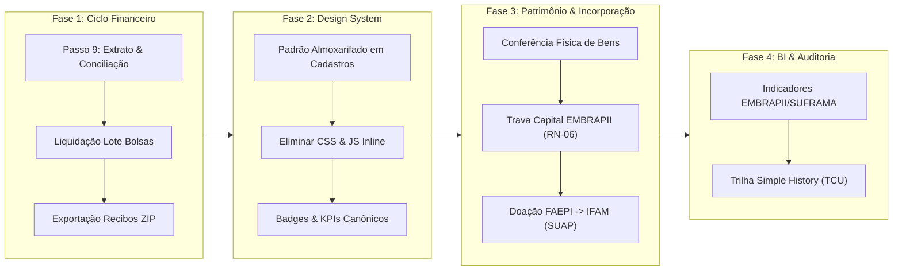

# Plano Mestre de Desenvolvimento e Evolução — ERP ARGUS
**Polo de Inovação IFAM / Unidade EMBRAPII de Automação Industrial e Tecnologias Sustentáveis**  
**Arquiteto & Tech Lead:** Antigravity-Gemini  
**Versão:** 1.0 — Setembro/2026  
**Status do Sistema Atual:** 98/98 Testes Automatizados Aprovados | Base de Dados PostgreSQL 18.6 | Design System Canônico Ativo

---

## 1. Visão Executiva e Diagnóstico do Estado Atual

O **ARGUS** alcançou um marco crítico de maturidade estrutural:
* **Banco de Dados & Modelo MER:** 100% normalizado perante os normativos federais (Lei 10.973/2004, Lei 8.958/1994, Decretos 9.283/2018 e Portarias SUFRAMA/EMBRAPII).
* **Camada de Testes de Produção:** 98 testes automatizados cobrindo liquidação em lote de folhas de bolsas, regras financeiras de cotas, anonimização LGPD irreversível de pessoas físicas com retenção de histórico para o TCU, e atesto por servidor efetivo SIAPE.
* **Design System Canônico (05_DESIGN_SYSTEM_ARGUS.md):** Estabelecido com Font Awesome 7.3.1 local (air-gapped, zero CDNs), tokens CSS `--argus-*` e componentes semânticos (`.card-kpi-argus`, `.badge-status-*`, `.thead-argus`).

### Panorama de Telas e Apps do Sistema:
| Módulo Django | Finalidade Primária | Modelos | Templates | Status Atual |
|---|---|:---:|:---:|:---:|
| **`cadastros`** | Governança Institucional, Pessoas, Termos e Wizard de Projetos | 40 | 48 | 80% Concluído (Faltam refinamentos de UI em CRUDs secundários) |
| **`gestao_projetos`** | Execução Físico-Financeira, Bolsas, Relatórios e Atestos | 8 | 18 | 75% Concluído (Passos 1 a 8 homologados; Passo 9 em aberto) |
| **`almoxarifado`** | Entrada/Saída de Materiais de Consumo, Notas e Estoque | 8 | 8 | 90% Concluído (Homologado na Sprint 2 com IBM Bob) |
| **`central_servicos`** | Gestão Predial, Laboratórios Inteligentes e Ordens de Serviço | 26 | 42 | 85% Concluído (Templates consolidados e CSS limpo) |
| **`patrimonio`** | Tombamento, Verificação Física e Rastreio de Ativos Permanentes | 4 | 8 | 60% Concluído (Estrutura pronta, aguarda integração fina) |
| **`incorporacao`** | Doação e Incorporação Patrimonial de Projetos PDI para o IFAM | 2 | 4 | 50% Concluído (Fluxo final do ciclo de vida de projetos) |

---

## 2. Roadmap Estratégico em 4 Fases



---

## 3. Detalhamento por Módulo e Funções de Desenvolvimento

---

### 🟢 FASE 1: Fechamento da Execução Financeira & Conciliação Bancária
**Foco:** Finalizar a esteira financeira de ponta a ponta para auditoria de prestação de contas.

#### Módulo: `gestao_projetos`
1. **Passo 9 da Execução Financeira (Conciliação & Extrato por Conta de Projeto):** `[CONCLUÍDO & HOMOLOGADO]`
   - **Função / View:** `extrato_financeiro_projeto(request, projeto_id)`
   - **Regra de Negócio (RN-02, RN-03):** Segregar os saldos bancários por fonte pagadora:
     * Conta 1: Recursos Empresa Parceira (Custeio + Overhead).
     * Conta 2: Subvenção Governamental EMBRAPII (Vedado Capital).
     * Conta 3: Aporte Sebrae / Outras fontes.
   - **Entrega Técnica:**
     * Cruzamento automático dos débitos com as baixas da view `liquidar_folha_lote()`.
     * Visão consolidada na **Aba 3 (Painel Central Orçamentário)** do Wizard de Projetos.
     * Indicador visual de conciliação (Conciliado vs. Pendente de Conciliação Bancária).
2. **Emissão Consolidada de Recibos e Comprovantes em Lote (.zip):** `[CONCLUÍDO & HOMOLOGADO]`
   - **Função / View:** `exportar_recibos_lote_zip(request, projeto_id)`
   - **Entrega Técnica:** Empacotamento in-memory em `.zip` dos recibos individuais em HTML autenticados com hash SHA-256 para anexação na prestação de contas da FAEPI perante o IFAM.
   - **Homologação:** 100% aprovado pela auditoria independente do **Kiro (AWS Bedrock)** com bateria de 5 invariantes de domínio e suíte `PropertyZipInvariantsTestCase`.

---

### 🟡 FASE 2: Padronização Canônica de UI/UX (Sprint Design System)
**Foco:** Aplicar rigorosamente o [Design System Canônico (05_DESIGN_SYSTEM_ARGUS.md)](file:///C:/Projetos/ARGUS/documentacao-tecnica/05_DESIGN_SYSTEM_ARGUS.md) nos 48 templates de `cadastros` e nos templates de apoio.

#### Módulo: `cadastros`
1. **Harmonização de Telas de Listagem (Padrão Almoxarifado):**
   - **Templates Alvo:**
     * `listar_projetos_pdi.html`, `listar_termos_parceria.html`, `listar_programas.html`.
     * `listar_pessoas_juridicas.html`, `listar_fornecedores.html`.
   - **Critérios de Aceite:**
     * Inclusão de Breadcrumbs e Link Voltar dinâmico.
     * KPIs canônicos com `.card-kpi-argus` (eliminar scripts `onmouseover` remanescentes).
     * Matriz de badges canônicos: `PENDENTE` em âmbar (`.badge-status-warning`), `ATIVO` em verde (`.badge-status-success`), `CANCELADO` em vermelho.
     * Tabelas com classe `.thead-argus` e proibição terminante de `` com `colspan` sob DataTables.
2. **Padronização de Formulários e Detalhes:**
   - **Templates Alvo:** `pessoa_juridica_form.html`, `termo_parceria_form.html`, `programa_form.html`.
   - **Critérios de Aceite:**
     * Inputs com classes padronizadas do Bootstrap 5 e validações visuais semânticas.
     * Centralização dos estilos em `static/css/style.css` (zero `<style>` inline).

---

### 🔵 FASE 3: Ciclo Completo de Patrimônio e Incorporação
**Foco:** Assegurar a rastreabilidade dos bens adquiridos com recursos de projetos de PD&I e sua doação legal para o patrimônio público do IFAM.

#### Módulo: `patrimonio`
1. **Verificação Física e Conferência de Itens:**
   - **Modelos:** `VerificacaoTermo`, `ItemVerificacao`, `BemPatrimonial`.
   - **Função / View:** `conferir_bens_projeto(request, projeto_id)`
   - **Regra de Negócio (RN-06):** Bloquear a vinculação de bens permanentes a fontes de subvenção estrita EMBRAPII (apenas permitidos com fontes Empresa ou Pró-ICT).

#### Módulo: `incorporacao`
1. **Processamento de Termos de Doação (Fim de Projeto):**
   - **Modelos:** `TermoDoacao`, `ItemPatrimonial`.
   - **Função / View:** `gerar_termo_doacao_projeto(request, projeto_id)`
   - **Fluxo Normativo:** Ao transicionar o projeto de `PRESTACAO_CONTAS` para `ENCERRADO`, gerar a minuta oficial de doação dos equipamentos para incorporação pelo setor de Patrimônio do IFAM com registro no SUAP.

---

### 🟣 FASE 4: BI Executivo, Auditoria & Prestação de Contas (EMBRAPII / SUFRAMA)
**Foco:** Geração de relatórios gerenciais consolidados para os órgãos reguladores e diretoria.

#### Módulo Transversal: `gestao_projetos` & `central_servicos`
1. **Painel de Indicadores Oficiais EMBRAPII:**
   - Taxa de alavancagem de recursos privados (Aporte Empresa / Aporte Total).
   - Indicador de TRL alcançado por Macroentrega (TRL 3 a 6).
   - Percentual de Overhead retido e creditado no Fundo de Reserva.
2. **Trilha de Auditoria com Simple History:**
   - Interface de visualização para auditores do TCU/CGU: delta de modificações em planos de trabalho, cotas de bolsas e movimentações orçamentárias.

---

## 4. Matriz de Distribuição e Segregação da Squad de IA (Protocolo SoD)

Para garantir produtividade extrema com zero conflitos de concorrência, o trabalho será fatiado de acordo com o [Protocolo de Colaboração da Squad](file:///C:/Projetos/ARGUS/documentacao-tecnica/governanca_squad_ia/PROTOCOLO_COLABORACAO_IA.md):

```
+-------------------------------------------------------------------------------+
|                        SQUAD DE DESENVOLVIMENTO IA                            |
+-------------------------------------------------------------------------------+
|  Antigravity-Gemini  | Tech Lead & Arquiteto   | SRS, Arquitetura, Auditoria  |
|                      | (Gemini 3.1 Pro)        | de Governança e Validação    |
+----------------------+-------------------------+------------------------------+
|  IBM Bob             | Frontend & UI/UX        | Design System, Templates,    |
|                      |                         | CSS Global e Badges          |
+----------------------+-------------------------+------------------------------+
|  GitHub Copilot      | Engenharia de Backend   | Views, Otimizações ORM,      |
|                      |                         | Transações ACID e Regras RN  |
+----------------------+-------------------------+------------------------------+
|  Kiro (AWS Bedrock)  | Qualidade & Testes      | Suítes Automatizadas,        |
|                      |                         | Casos de Borda e Regressão   |
+----------------------+-------------------------+------------------------------+
```
