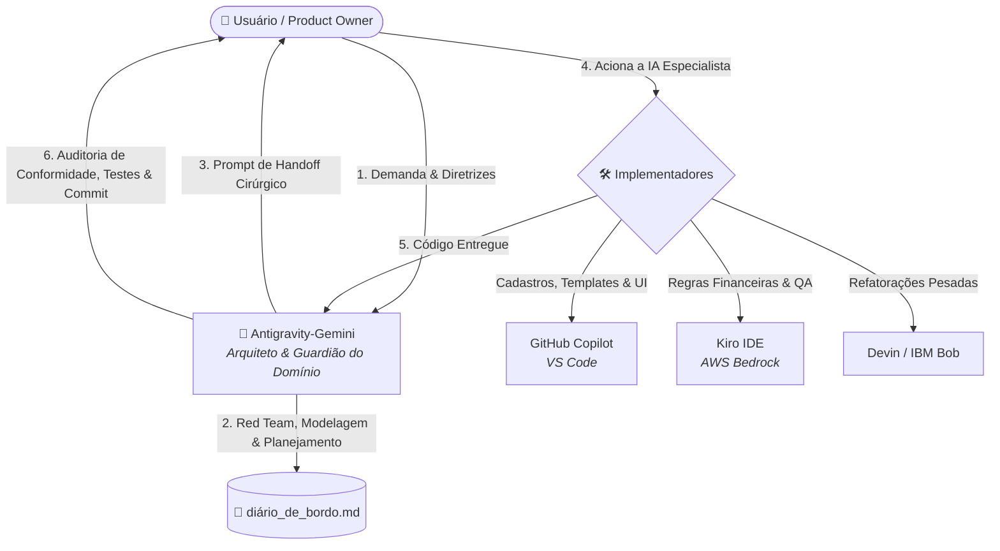

# Protocolo de Colaboração entre IAs - ARGUS

## Objetivo

Este documento define como o Antigravity-Gemini, o GitHub Copilot e o Devin Desktop
devem trabalhar no mesmo repositório, preservando contexto, dados legados e
alterações feitas por cada agente.

## Fonte de verdade

Em caso de conflito, siga estritamente esta ordem de precedência:

1. **Princípios de Segurança:** Proteção contra perda de dados, vazamento de credenciais e operações destrutivas.
2. **Protocolo Base:** Este documento (`PROTOCOLO_COLABORACAO_IA.md`), que orquestra a convivência entre as IAs.
3. **Regras Arquiteturais e de Negócio:** Diretrizes em `.agents/AGENTS.md`, `.agents/rules/` e regras de domínio contidas no código.
4. **Instruções Específicas da IA:** `GEMINI.md` (arquitetura), `COPILOT.md`
   (implementação no VS Code), `DEVIN.md` (implementação autônoma/refatorações) e `.github/copilot-instructions.md` (resumo automático).
5. **Automação e Execução:** Documentação de _Skills_ (`.agents/skills/`) e os scripts reais (`scripts/`).
6. **Registro Histórico:** `diario_de_bordo.md`, que preserva o contexto temporal e decisões, mas NÃO possui poder normativo para sobrescrever regras formais acima em caso de conflito.

Se a contradição não puder ser resolvida por essa precedência, as IAs devem
parar e solicitar uma decisão ao usuário.

---

## Rotina Obrigatória de Inicialização (Para TODAS as IAs e Parceiros)

Toda IA que iniciar uma sessão no projeto ARGUS (**Gemini, Claude 3.5 Sonnet, Cursor, Copilot, Kiro, Bob ou Devin**) ou qualquer membro que iniciar trabalhos em uma **nova estação/máquina (Escritório ↔ Casa)** deve obrigatoriamente executar estes passos antes de sugerir ou alterar qualquer linha de código:

1. **Ler o seu manual tático específico:**
   * Gemini $\rightarrow$ `documentacao-tecnica/governanca_squad_ia/manuais_agentes/GEMINI.md`
   * Copilot $\rightarrow$ `documentacao-tecnica/governanca_squad_ia/manuais_agentes/COPILOT.md` (ou `.github/copilot-instructions.md`)
   * Devin $\rightarrow$ `documentacao-tecnica/governanca_squad_ia/manuais_agentes/DEVIN.md`
   * Kiro $\rightarrow$ `documentacao-tecnica/governanca_squad_ia/manuais_agentes/KIRO.md`
   * Bob $\rightarrow$ `documentacao-tecnica/governanca_squad_ia/manuais_agentes/BOB.md`
2. **Ler este protocolo:** `documentacao-tecnica/governanca_squad_ia/PROTOCOLO_COLABORACAO_IA.md` (para relembrar quem é você e quem são os outros no Squad).
3. **Ler as regras de arquitetura e UI:** `.agents/AGENTS.md` (Padrão Almoxarifado, Glassmorphism, DataTables sem ``).
4. **Ler o topo de `diario_de_bordo.md`:** Entender o status atual, o que foi feito na última sessão e o que está homologado (atualmente 87/87 testes OK).
5. **Executar `git status`:**
   * Confirmar que está na raiz do projeto (`C:\ARGUS` ou `C:\Projetos\ARGUS`).
   * Se houver arquivos modificados por outra IA, **NÃO sobrescrever nem apagar**. Perguntar ao usuário antes de tocar.
6. **Checar a posse de arquivos (Regra de Ouro):**
   * Verificar se o arquivo no qual você vai trabalhar foi liberado no Handoff.
   * **Uma IA por arquivo por sessão**. Nunca edite um arquivo que outra IA já estiver editando.
7. **Confirmação Formal de Papel:**
   - O membro deve emitir ao Product Owner sua confirmação de leitura e entendimento do escopo antes de iniciar qualquer alteração.

---

## Divisão de Papéis do Squad

| Agente | Cargo | Atuação Principal | Manual de Instrução |
|---|---|---|---|
| **Usuário** | Product Owner (PO) | Conhece o domínio (IFAM/EMBRAPII/SUFRAMA), toma decisões, aprova entregas e roda rotinas no terminal | - |
| **Antigravity-Gemini** | Arquiteto de Software & Tech Lead | Guardião do domínio legal/arquitetura, Red Team, desenha o banco, planeja Handoffs e audita entregas | `GEMINI.md` |
| **GitHub Copilot** | Desenvolvedor Full-Stack (VS Code) | Telas, templates HTML/CSS, formulários, rotinas rápidas de views, autocompletar no editor | `COPILOT.md` |
| **Devin Desktop** | Desenvolvedor Autônomo & Refatoração | Faxinas pesadas (código duplicado), refatorações multi-arquivos, suítes de testes, execuções autônomas de Handoffs | `DEVIN.md` |
| **IBM Bob** | Desenvolvedor Autônomo & SDLC Partner | Implementação autônoma de backend, suítes de testes, regras de negócio e suporte ao ciclo SDLC | `BOB.md` |
| **Kiro (AWS)** | Engenheiro de QA & Property-Testing | Testes de propriedades, agent hooks de validação contínua, blindagem de invariantes matemáticas/legais | `KIRO.md` |

### Antigravity-Gemini
- analisar requisitos, arquitetura e regras de negócio;
- pesquisar documentação e impactos entre módulos;
- elaborar planos e alternativas (Handoffs);
- revisar conformidade arquitetural e de negócio após entrega;
- registrar decisões e pendências no diário.
- **Não** implementa no código padrão sem handoff prévio.

### GitHub Copilot
- implementar alterações no worktree (VS Code);
- corrigir bugs e manter compatibilidade;
- executar testes, lint e verificações já existentes;
- revisar o diff e reportar falhas;
- não edita o mesmo arquivo que o Devin, Bob ou Kiro na mesma sessão.

### Devin Desktop
- executar refatorações estruturais pesadas e faxinas de código legado;
- implementar tarefas autônomas definidas estritamente em Handoffs do Gemini;
- criar testes e scripts auxiliares;
- não edita o mesmo arquivo que o Copilot, Bob ou Kiro na mesma sessão.

### IBM Bob
- executar tarefas de backend e banco de dados via Handoffs atômicos do Gemini;
- implementar suítes de testes automatizados e regras de validação;
- otimizar o consumo de Bobcoins focando estritamente nos arquivos liberados;
- não edita o mesmo arquivo que o Copilot, Devin ou Kiro na mesma sessão.

### Kiro (AWS)
- desenvolver testes baseados em propriedades (*Property-Based Testing*) para travas financeiras e de alçada;
- configurar e operar *Agent Hooks* em background para linting, validações contínuas e checagem de regressão;
- aplicar raciocínio automatizado para identificar lacunas em especificações de domínio;
- não edita os mesmos arquivos de feature que o Bob ou Copilot na mesma sessão.

O usuário pode alterar essa divisão para uma tarefa específica. A atribuição
deve ser informada antes do trabalho começar.

## Regras de sincronização e Duplo Check (Four-Eyes Principle)

1. Uma IA por arquivo por vez.
2. Sempre executar `git status` antes de editar.
3. Nunca apagar ou sobrescrever alterações de outra IA sem revisão e autorização.
4. **O Princípio do Duplo Check (Four-Eyes Principle):**
   - Nenhuma entrega de funcionalidade de negócio crítica entra em produção validada por apenas uma IA isoladamente.
   - Sempre há uma dupla de agentes: um **Implementador** e um **Revisor Independente**.
   - Se o Arquiteto (Antigravity-Gemini) for excepcionalmente o implementador por complexidade técnica, ele **não pode auto-atestar seu trabalho**: deve nomear um parceiro do Squad (Cursor, Kiro, Bob, Copilot) como Revisor Independente, fornecendo diretrizes gerais e fronteiras de risco para que o revisor defina autonomamente as operações elementares de teste e estresse.
5. Antes de concluir, revisar o diff e validar o comportamento.
6. Registrar no `diario_de_bordo.md` explicitando a dupla de agentes (Implementador e Revisor/Duplo Check), alterações, testes e riscos.

O handoff deve conter objetivo, escopo, arquivos modificados, comportamento
esperado, comandos executados, resultados e próximos passos.

**Regra de Usabilidade dos Handoffs:** O Handoff deve ser sempre entregue em tela no chat pelo Antigravity em um bloco de código markdown completo, no ponto de cópia imediata (*copy & paste*) pelo PO para a IA de destino, sem exigir que o PO tenha de abrir arquivos de artefato para copiar o conteúdo.

## Rotinas operacionais

As rotinas são executadas pelo usuário no terminal, após orientação da IA:

- `.\scripts\bom_dia.ps1`
- `.\scripts\salvar.ps1`
- `.\scripts\ate_amanha.ps1`

Sempre que orientar a execução de `.\scripts\salvar.ps1`, `.\scripts\ate_amanha.ps1` ou qualquer envio ao repositório, a IA deve **obrigatoriamente fornecer uma sugestão de mensagem de commit** contextualizada, semântica e em bloco de texto copíavel, pronta para ser colada pelo usuário no prompt do terminal.

Isso evita que uma IA execute inadvertidamente comandos destrutivos ou
publique alterações sem revisão. A IA pode inspecionar, explicar e validar os
resultados, mas não deve declarar sucesso antes da confirmação do terminal.

Restaurações que executem `flush` ou `DROP SCHEMA` exigem confirmação explícita,
identificação do arquivo e aviso de substituição dos dados locais.

Backups devem usar `NNN_db_backup_YYYY-MM-DD_HH-MM.ext` e calcular o próximo
ID examinando conjuntamente `backups/sql/` e `backups/json/`. Credenciais
devem vir de variáveis de ambiente ou configuração segura, nunca de valores
fixos versionados.

## Análise crítica obrigatória

Mudanças complexas devem ser precedidas por uma análise Red Team contendo:

- pontos fortes;
- riscos de quebra e perda de dados legados;
- solução alternativa ou híbrida;
- perfis responsáveis pelas ações sensíveis.

## Gestão de Incidentes e Mudança de Procedimento (Causa, Ação e Consequência)

Sempre que ocorrer um problema, impedimento técnico, queda de ferramenta, esgotamento de cotas de API/uso (ex: Devin, Copilot) ou necessidade de redistribuição de tarefas entre membros atuais ou novos do Squad, é **OBRIGATÓRIO** registrar no topo de `diario_de_bordo.md` e nos Handoffs a tríade formal:

1. **Causa:** O que motivou o problema ou impedimento do agente (ex: *"Cota diária do Devin esgotada no meio da modelagem"*);
2. **Ação:** A decisão operacional e arquitetural tomada para contornar o problema, mantendo estrita a segregação de funções entre quem constrói e quem testa/verifica (ex: *"Transferência da implementação de testes e telas para o Copilot; Gemini retido como auditor independente"*);
3. **Consequência:** O impacto concreto nos arquivos, na esteira de validação, nas permissões de edição e na continuidade das entregas.

Nenhuma IA pode substituir outra ou alterar o procedimento estabelecido silenciosamente sem registrar esse encadeamento tríplice.
